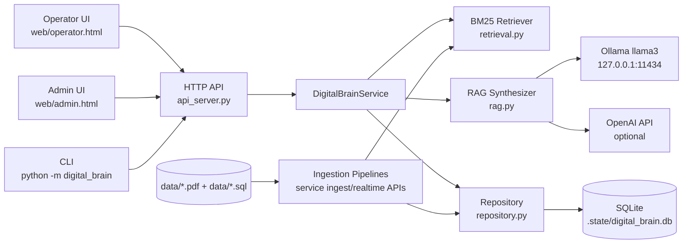
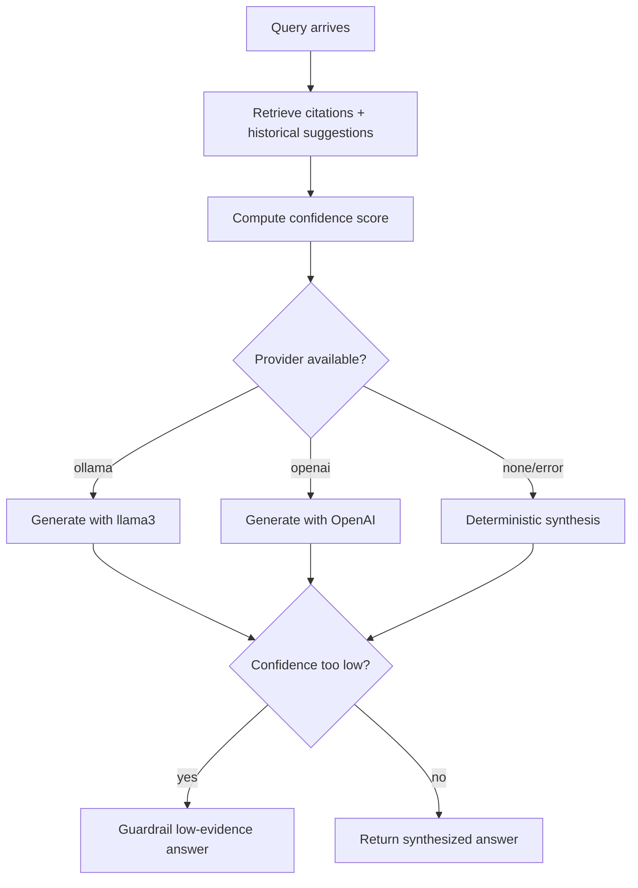
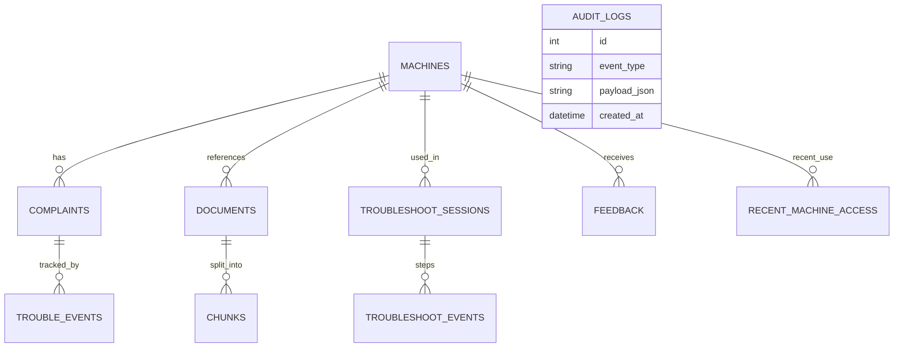
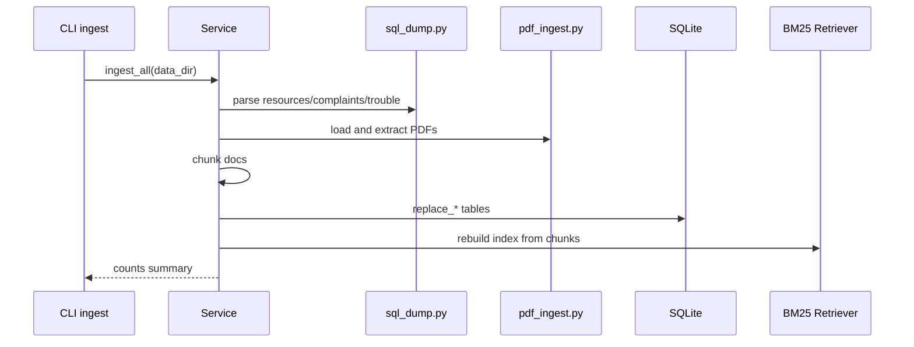
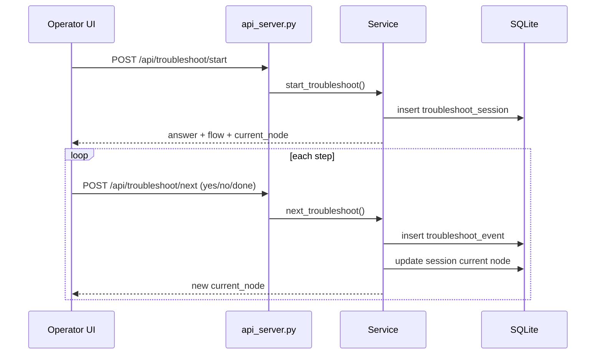

# Digital Brain System Implementation (Detailed)

## 1. Purpose Of This Document
This document explains the full implementation that currently exists in the repository, including:

- System architecture
- RAG pipeline behavior (deterministic + LLM)
- Realtime ingestion and realtime learning loop
- Operator and admin interaction flows
- API and CLI contract
- Data model and persistence
- What is complete vs pending vs intentionally deferred

This is intended to let any engineer understand and continue the project without additional tribal context.

---

## 2. Executive Summary
The current implementation delivers an **end-to-end industrial troubleshooting MVP** over your seed dataset (PDF manuals + SQL dumps), with:

1. Seed ingestion of manuals and SQL history.
2. Retrieval-backed diagnosis (manual citations + historical fixes).
3. Interactive yes/no troubleshooting flow with persisted session state.
4. Feedback capture and immediate reuse in future ranking.
5. Realtime ingestion APIs for new docs/complaints/trouble events.
6. Admin analytics with unresolved queues and knowledge-gap signals.
7. Optional local LLM synthesis using **Ollama llama3** (default), with deterministic fallback.
8. Confidence gating and low-evidence guardrails.

---

## 3. Roadmap Status Mapping

### Phase 1: Thin Vertical Slice
Status: **Complete**

- PDF ingestion -> chunking -> retrieval with citations: done
- SQL canonical tables for machine/complaint/trouble history: done
- Working query flow (machine + issue -> grounded response): done
- Minimal API + UI answering with citations: done

### Phase 2: Operator Workflow MVP
Status: **Complete (with upgrades)**

- Machine selection + issue input: done
- Triage + checklist + yes/no branching: done
- Session close with thumbs up/down + workaround: done
- Recent machines widget: done
- Busy/loading states for LLM latency: done

### Phase 3: Learning Loop
Status: **Complete MVP + Realtime behavior**

- Seed workaround memory from complaint/trouble SQL: done
- Realtime feedback reuse on next query: done
- Dual guidance “manual says X / historically worked Y”: done
- Trace tag on historical suggestions: done

### Phase 4: Admin Dashboard MVP
Status: **Complete MVP+**

- Top breakdowns: done
- Unresolved queue: done
- At-risk queue (failed feedback): done
- Category and monthly trend slices: done
- Knowledge-gap keyword clusters: done

### Phase 5: Hardening
Status: **Partially complete (core controls implemented)**

Implemented:
- Confidence scoring + labels
- Citation/low-evidence guardrail path
- Audit logging
- Unit/smoke tests

Still pending for production hardening:
- Full authN/authZ
- Rich observability stack (metrics/tracing dashboard)
- Concurrency/load validation for larger scale
- Migration strategy beyond SQLite

---

## 4. High-Level Architecture



### Runtime mode selection for RAG synthesis



---

## 5. Repository Structure (Core)

- `src/digital_brain/service.py`  
  orchestration: ingest, query, troubleshooting sessions, realtime updates, analytics composition
- `src/digital_brain/repository.py`  
  SQLite persistence and query helpers
- `src/digital_brain/rag.py`  
  synthesis adapter (ollama/openai/deterministic)
- `src/digital_brain/retrieval.py`  
  BM25 retriever over text chunks
- `src/digital_brain/chunking.py`  
  document chunk generation
- `src/digital_brain/pdf_ingest.py`  
  PDF extraction via `pdftotext`
- `src/digital_brain/sql_dump.py`  
  tolerant parser for MySQL dump INSERT blocks
- `src/digital_brain/api_server.py`  
  API routes and static UI serving
- `src/digital_brain/cli.py`  
  operational CLI
- `web/operator.html`  
  operator UX
- `web/admin.html`  
  management dashboard
- `tests/test_service_smoke.py`, `tests/test_sql_dump.py`  
  baseline tests

---

## 6. Data Model (SQLite)

Main tables:

- `machines`
- `complaints`
- `trouble_events`
- `documents`
- `chunks`
- `feedback`
- `troubleshoot_sessions`
- `troubleshoot_events`
- `recent_machine_access`
- `audit_logs`

ER-style relationship view:



---

## 7. Ingestion Pipelines

## 7.1 Seed ingestion (`ingest`)

1. Parse machine metadata from `eqp-process_resources.sql`
2. Parse complaints from `equipment_complaint.sql`
3. Parse trouble tracking from `trouble_track.sql`
4. Load all PDFs in `data/`
5. Chunk PDF text
6. Persist all to SQLite
7. Rebuild in-memory retriever index

Sequence:



## 7.2 Realtime ingestion

### Realtime document ingest
- Endpoint: `POST /api/realtime/document`
- Input: PDF path + optional `machine_id`, `doc_type`
- Behavior:
  1. Extract text from the file
  2. Upsert document row
  3. Replace chunks for that document
  4. Rebuild retriever index immediately

### Realtime complaint upsert
- Endpoint: `POST /api/realtime/complaint`
- Adds/updates complaint row immediately
- Can create new complaint ID if not provided

### Realtime trouble event insert
- Endpoint: `POST /api/realtime/trouble-event`
- Adds action history to `trouble_events`
- Becomes available to ranking on next query

---

## 8. Query and Troubleshooting Flows

## 8.1 One-shot query flow

Input: machine id + user question

1. Retrieve top chunks filtered by machine context
2. Build citation payload
3. Build historical suggestions (complaint/trouble + feedback loop)
4. Compute confidence
5. Generate answer via RAG synthesizer
6. Apply low-confidence guardrail if needed
7. Return answer + metadata + checklist + flow

Response includes:
- `answer`, `answer_mode`
- `triage`
- `confidence_score`, `confidence_label`
- `citations`
- `historical_suggestions`
- `troubleshooting_flow`

## 8.2 Persistent troubleshooting session flow

- Start: `POST /api/troubleshoot/start`
- Step: `POST /api/troubleshoot/next`
- Read state: `GET /api/troubleshoot/session`

State machine behavior:
- question node -> accepts `yes/no`
- action node -> accepts `done`
- final node -> session closes

Sequence:



---

## 9. RAG Details

## 9.1 Retrieval layer
- BM25 lexical retrieval over chunk text (`retrieval.py`)
- Machine-aware filtering by `machine_id`
- Top-k chunk output with score and snippet

## 9.2 Synthesis layer
Implemented modes:

1. `llm_ollama` (default attempt)
- Provider env default is `ollama`
- Model default: `llama3`
- Endpoint: `http://127.0.0.1:11434/api/generate`

2. `llm_openai` (optional)
- Used if provider is set to `openai` and API key is present

3. `deterministic` fallback
- Used when provider unavailable or errors

## 9.3 Guardrails
- Confidence score is computed from citation score quality + suggestion support
- If no citations or confidence is very low -> guarded response
- Guarded response explicitly states insufficient evidence

---

## 10. Learning Loop (Realtime)

The system uses three memory sources for historical guidance:

1. `equipment_complaint`
2. `trouble_track`
3. `feedback` (thumbs + workaround)

Ranking behavior now:
- Query relevance (term overlap/Jaccard-like similarity)
- Resolution status bonus
- Recency bonus
- Event-level recency and complaint weight
- Feedback workaround boost for helpful feedback

This ensures that new complaint/trouble/feedback inputs can influence next-query recommendations without batch retraining.

---

## 11. Operator UI Behavior

Implemented in `web/operator.html`:

1. Recent machines panel
2. Machine selector and issue input
3. Triage smart chips (`Power`, `Hydraulics`, `Tooling`)
4. Diagnosis answer + mode/confidence display
5. Checklist and citations
6. Historical suggestions
7. Interactive yes/no troubleshooting flow
8. Feedback capture (`Thumbs Up/Down` + workaround)
9. Loading indicator and busy-state locking for latency visibility

---

## 12. Admin UI Behavior

Implemented in `web/admin.html`:

- Top breakdown machines
- Breakdowns by category
- Monthly breakdown trend
- Unresolved issue queue
- Knowledge-gap keyword clusters
- At-risk queue from failed feedback
- Feedback summary by machine

---

## 13. API Reference (Current)

### Machine and query
- `GET /api/machines`
- `GET /api/machines/recent?limit=8`
- `POST /api/query`

### Troubleshooting session
- `POST /api/troubleshoot/start`
- `POST /api/troubleshoot/next`
- `GET /api/troubleshoot/session?session_id=...`

### Feedback
- `POST /api/feedback`

### Realtime ingest
- `POST /api/realtime/document`
- `POST /api/realtime/complaint`
- `POST /api/realtime/trouble-event`

### Admin
- `GET /api/admin/analytics`

### 13.1 API JSON Examples
All payloads below are illustrative examples from the current contract in `src/digital_brain/api_server.py`.

#### `GET /api/machines`

Response:

```json
{
  "machines": [
    {
      "machine_id": 7,
      "name": "ICP Etcher",
      "category": "Etching",
      "location": "Lab-Bay-2"
    },
    {
      "machine_id": 12,
      "name": "Spin Coater",
      "category": "Lithography",
      "location": "Lab-Bay-1"
    }
  ]
}
```

#### `GET /api/machines/recent?limit=8`

Response:

```json
{
  "recent_machines": [
    {
      "machine_id": 7,
      "name": "ICP Etcher",
      "issue": "Pressure drift during plasma step",
      "session_id": "9ffba9c2-d0b8-44f3-89f1-822a09cd35d4",
      "created_at": "2026-02-17 19:15:45"
    }
  ]
}
```

Common error:

```json
{
  "error": "limit must be an integer"
}
```

#### `POST /api/query`

Request:

```json
{
  "machine_id": 7,
  "question": "RF power is unstable and chamber pressure is fluctuating"
}
```

Response:

```json
{
  "session_id": "7bb5ab1e-4f5f-4d8b-90f2-7e37f11f9f6c",
  "machine_id": 7,
  "answer": "Machine 7 triage category: Power. Validate interlocks and breaker chain, then run a controlled cycle...",
  "answer_mode": "llm_ollama",
  "triage": "Power",
  "confidence_score": 0.79,
  "confidence_label": "high",
  "checklist": [
    "Is the machine main power indicator ON? [Yes/No]",
    "Are breaker and interlock statuses normal? [Yes/No]",
    "Run one controlled dummy cycle and verify alarms. [Pass/Fail]"
  ],
  "citations": [
    {
      "doc_type": "manual",
      "path": "data/7_manuals.pdf",
      "snippet": "If RF instability occurs, inspect interlock continuity and verify breaker state before process restart.",
      "score": 9.412
    }
  ],
  "historical_suggestions": [
    {
      "action": "Verify breaker and interlock chain and retest.",
      "support_count": 4,
      "trace": "equipment_complaint + trouble_track"
    },
    {
      "action": "Replacing the RF fuse resolved recurrence.",
      "support_count": 3,
      "trace": "feedback_loop"
    }
  ],
  "troubleshooting_flow": {
    "start_node_id": "q1",
    "query_terms": [
      "rf",
      "power",
      "unstable",
      "chamber",
      "pressure",
      "fluctuating"
    ],
    "history_snapshot": {
      "power": {
        "count": 32,
        "support_count": 11
      }
    },
    "nodes": [
      {
        "id": "q1",
        "kind": "question",
        "text": "Is the machine powered and interlocks healthy?",
        "yes": "q2",
        "no": "a_power"
      }
    ]
  }
}
```

Common errors:

```json
{
  "error": "machine_id is required"
}
```

```json
{
  "error": "question is required"
}
```

#### `POST /api/troubleshoot/start`

Request:

```json
{
  "machine_id": 7,
  "question": "Leak and unstable pressure near chamber manifold"
}
```

Response:

```json
{
  "session_id": "2b6a9df4-6ef1-43ac-8f9d-67442f29eddd",
  "machine_id": 7,
  "answer": "Initial grounded diagnosis...",
  "answer_mode": "llm_ollama",
  "triage": "Hydraulics",
  "confidence_score": 0.66,
  "confidence_label": "medium",
  "checklist": [
    "Is the required gas or flow source available and within range? [Yes/No]"
  ],
  "citations": [],
  "historical_suggestions": [],
  "troubleshooting_flow": {
    "start_node_id": "q1",
    "nodes": []
  },
  "current_node": {
    "id": "q1",
    "kind": "question",
    "text": "Is vacuum/pressure in expected operating range?",
    "yes": "q2",
    "no": "a_pressure"
  },
  "is_closed": false
}
```

#### `POST /api/troubleshoot/next`

Request:

```json
{
  "session_id": "2b6a9df4-6ef1-43ac-8f9d-67442f29eddd",
  "response": "no"
}
```

Response:

```json
{
  "session_id": "2b6a9df4-6ef1-43ac-8f9d-67442f29eddd",
  "machine_id": 7,
  "current_node": {
    "id": "a_pressure",
    "kind": "action",
    "text": "Check chamber pressure and pump health.",
    "next": "q2"
  },
  "is_closed": false,
  "allowed_responses": [
    "done"
  ]
}
```

Common error:

```json
{
  "error": "Question node accepts response: yes/no"
}
```

#### `GET /api/troubleshoot/session?session_id=...`

Response:

```json
{
  "session_id": "2b6a9df4-6ef1-43ac-8f9d-67442f29eddd",
  "machine_id": 7,
  "question": "Leak and unstable pressure near chamber manifold",
  "triage": "Hydraulics",
  "is_closed": false,
  "current_node": {
    "id": "a_pressure",
    "kind": "action",
    "text": "Check chamber pressure and pump health.",
    "next": "q2"
  },
  "allowed_responses": [
    "done"
  ]
}
```

#### `POST /api/feedback`

Request:

```json
{
  "session_id": "2b6a9df4-6ef1-43ac-8f9d-67442f29eddd",
  "machine_id": 7,
  "issue": "Pressure drift during ignition",
  "helpful": true,
  "workaround": "Replacing manifold O-ring stabilized pressure immediately."
}
```

Response:

```json
{
  "ok": true
}
```

#### `POST /api/realtime/document`

Request:

```json
{
  "path": "data/new_manual_update.pdf",
  "machine_id": 7,
  "doc_type": "manual"
}
```

Response:

```json
{
  "doc_id": "new_manual_update",
  "chunk_count": 41
}
```

#### `POST /api/realtime/complaint`

Request:

```json
{
  "machine_id": 7,
  "complaint_description": "Pressure spike observed after plasma ignition.",
  "time_of_complaint": "2026-02-17 17:40:00",
  "status": 0,
  "status_resolved": "open"
}
```

Response:

```json
{
  "complaint_id": 4001
}
```

#### `POST /api/realtime/trouble-event`

Request:

```json
{
  "complaint_id": 4001,
  "timestamp": "2026-02-17 18:05:00",
  "diagnosis": "Gas manifold seating issue",
  "action_taken": "Re-seated manifold and replaced O-ring.",
  "comments": "Second test cycle passed."
}
```

Response:

```json
{
  "ok": true,
  "complaint_id": 4001
}
```

#### `GET /api/admin/analytics`

Response:

```json
{
  "top_breakdowns": [
    {
      "machine_id": 7,
      "name": "ICP Etcher",
      "count": 40
    }
  ],
  "category_breakdowns": [
    {
      "category": "Etching",
      "count": 122
    }
  ],
  "monthly_breakdowns": [
    {
      "month_key": "2026-02",
      "count": 31
    }
  ],
  "unresolved_issues": [],
  "failed_feedback": [],
  "feedback_summary": [],
  "knowledge_gaps": [
    {
      "keyword": "pressure",
      "count": 9
    }
  ]
}
```

---

## 14. CLI Reference

Core:

- `python -m digital_brain ingest --data-dir data`
- `python -m digital_brain query --machine-id 7 --question "..."`
- `python -m digital_brain serve --host 127.0.0.1 --port 8080`

Troubleshooting sessions:

- `python -m digital_brain troubleshoot-start ...`
- `python -m digital_brain troubleshoot-next ...`
- `python -m digital_brain troubleshoot-session ...`

Realtime updates:

- `python -m digital_brain realtime-add-document ...`
- `python -m digital_brain realtime-add-complaint ...`
- `python -m digital_brain realtime-add-trouble-event ...`

Analytics/recent:

- `python -m digital_brain recent-machines --limit 8`
- `python -m digital_brain analytics`

---

## 15. Configuration

### LLM provider defaults
Current default mode: `ollama`

Env vars:

- `DIGITAL_BRAIN_LLM_PROVIDER` (`ollama` | `openai` | `none`)
- `DIGITAL_BRAIN_OLLAMA_MODEL` (default `llama3`)
- `DIGITAL_BRAIN_OLLAMA_BASE_URL` (default `http://127.0.0.1:11434`)
- `DIGITAL_BRAIN_OPENAI_MODEL` (default `gpt-4.1-mini`)
- `OPENAI_API_KEY` (required only for OpenAI mode)
- `DIGITAL_BRAIN_LLM_TIMEOUT_SEC` (default `20`)

---

## 16. Observability and Audit

Every critical interaction emits an audit row into `audit_logs`:

- `query`
- `troubleshoot_start`
- `troubleshoot_next`
- `feedback`
- realtime ingest events

Audit payload is stored as JSON for post-hoc analysis and debugging.

---

## 17. Known Limits and Risks

1. SQLite is great for local/dev, but not enough for heavy concurrent production traffic.
2. BM25 is lexical; semantic retrieval quality can be improved by embedding vectors.
3. Knowledge-gap clustering is currently keyword-frequency based; not semantic clustering.
4. LLM answers are grounded by prompt and guardrail, but strict citation span verification can be further strengthened.
5. Realtime doc ingest currently rebuilds in-process retriever (acceptable for MVP scale, not ideal for very large corpora).

---

## 18. Suggested Next Engineering Steps

1. Replace/reinforce retrieval with hybrid vector + BM25 index.
2. Move persistence to Postgres + vector extension for scale.
3. Add auth + role controls (operator/admin).
4. Add dedicated telemetry dashboard (request latency, retrieval hit-rate, fallback-rate, feedback outcome trend).
5. Add queue-backed async ingest workers for high ingest throughput.
6. Add stronger grounding checks (answer sentence must map to citation chunk IDs).

---

## 19. End-to-End Mental Model

The implemented system can be viewed as:

- **Industrial memory substrate** (manuals + incident history + feedback)
- **Retrieval and synthesis engine** (grounded answering with optional local LLM)
- **Operator decision workflow** (interactive branching + session persistence)
- **Continuous learning loop** (new events and feedback update guidance in near realtime)
- **Management observability layer** (breakdowns, unresolved, and knowledge gaps)

This architecture is aligned with your vision of a self-evolving industrial knowledge base, while still keeping the implementation practical and operable with your current dataset and local infrastructure.
