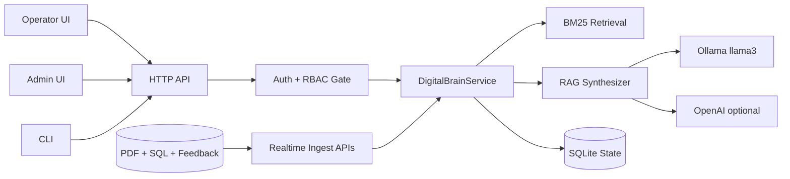

# Digital Brain Executive Brief

## 1. What This System Is
Digital Brain is an operator-first industrial troubleshooting platform that combines:

- Manual/SOP/Policy/Recipe retrieval
- Historical maintenance intelligence
- Hybrid troubleshooting flow generation (LLM-assisted + deterministic guardrails)
- Human-in-the-loop feedback learning
- Authenticated role-based access (`operator`, `admin`)

It is designed to answer floor issues with grounded evidence and improve from actual repair outcomes.

---

## 2. Current Delivery Status
Overall: **MVP end-to-end delivered** with realtime updates, RBAC auth, and local LLM support.

### Canonical UI Routes
- Login: `/login`
- Operator: `/operator`
- Admin: `/admin`
- Legacy `.html` pages are fallback-only compatibility paths.

### Completed
- Seed ingestion from PDFs + SQL dumps
- Retrieval with citations and machine-aware context
- Operator diagnosis flow with branching troubleshooting
- Hybrid flow mode:
  - `llm_assisted` when LLM response is available and validated
  - `deterministic_fallback` with explicit `flow_reason` when invalid/unavailable
- Session persistence for troubleshooting state
- Feedback capture (`thumbs up/down` + workaround)
- Realtime ingest APIs (docs, complaints, trouble events)
- Realtime ranking updates from fresh feedback/history
- Admin dashboard analytics (breakdowns, unresolved, trends, risk queue)
- Admin user management (create/update users, role and active status)
- Auth APIs + session cookies + role enforcement
- Confidence guardrails + audit logging
- Local LLM synthesis via **Ollama llama3** (default)

### Partially Complete / Next Hardening
- Enterprise auth hardening (password reset policy, SSO integration, account governance)
- Scalable DB/index infrastructure beyond local SQLite
- Advanced observability dashboards
- Deeper semantic retrieval + stricter citation span validation

---

## 3. Architecture (High-Level)

Core runtime principle:
1. Authenticate and authorize request.
2. Retrieve grounded evidence.
3. Synthesize response (LLM if available).
4. Build troubleshooting flow (LLM-assisted with deterministic validation/fallback).
5. Persist interactions and learn from outcomes.

---

## 4. Key User Flows

### Operator Flow
1. Login as operator/admin.
2. Select machine + describe issue.
3. Receive grounded answer with citations and confidence.
4. Execute interactive troubleshooting nodes (`yes/no/done`).
5. Submit outcome and workaround.
6. Next similar issue benefits from this feedback.

### Admin Flow
1. Login as admin.
2. Monitor top breakdown machines and unresolved/risk issues.
3. Manage user access (create/update role/active/password).
4. Review category/month trends and knowledge-gap signals.

---

## 5. Realtime Learning Behavior
The system updates recommendations immediately from:

- New complaints
- New trouble events
- New operator feedback workarounds
- Newly ingested manuals

No batch retraining is required for these updates to influence the next query.

---

## 6. RAG and LLM Strategy

### Current behavior
- Retrieval-first grounding is always used.
- LLM synthesis is optional, not mandatory.
- Default provider is local: **Ollama + llama3**.
- Deterministic answer fallback is automatic if LLM is unavailable.
- Troubleshooting flow can be LLM-assisted, but only after schema/transition validation.

### Safety controls
- Confidence score + confidence label in responses
- Low-evidence guardrail answer path
- Flow validation guardrails and deterministic fallback reason
- Audit logging of major events and transitions

---

## 7. APIs (Executive View)

- Auth: `/api/auth/login`, `/api/auth/logout`, `/api/auth/me`
- Query + diagnosis: `/api/query`, `/api/troubleshoot/start`, `/api/troubleshoot/next`
- Feedback: `/api/feedback`
- Realtime ingest: `/api/realtime/document`, `/api/realtime/complaint`, `/api/realtime/trouble-event`
- Admin analytics: `/api/admin/analytics`
- Admin users: `/api/admin/users`, `/api/admin/users/update`
- Recent machine activity: `/api/machines/recent`

---

## 8. KPI-Ready Outputs Available Now
You can already measure:

- Frequent breakdown assets
- Unresolved issue backlog
- Failed feedback (at-risk queue)
- Feedback helpfulness trends
- Knowledge-gap keyword clusters
- Session-level troubleshooting progression

---

## 9. Immediate Next Steps (Recommended)
1. Move from SQLite to production DB + hybrid retrieval infra.
2. Extend auth to enterprise controls (reset/rotation/SSO).
3. Add service telemetry (latency, fallback rate, confidence distribution, flow-mode distribution).
4. Expand test suite for concurrency and larger realtime ingest volume.
5. Strengthen semantic clustering and citation span verification.

---

## 10. Bottom Line
The platform is functioning as a practical, self-improving troubleshooting assistant with RBAC access control, realtime learning, and local-LLM support. Next phase is production hardening and scale, not core feature invention.
