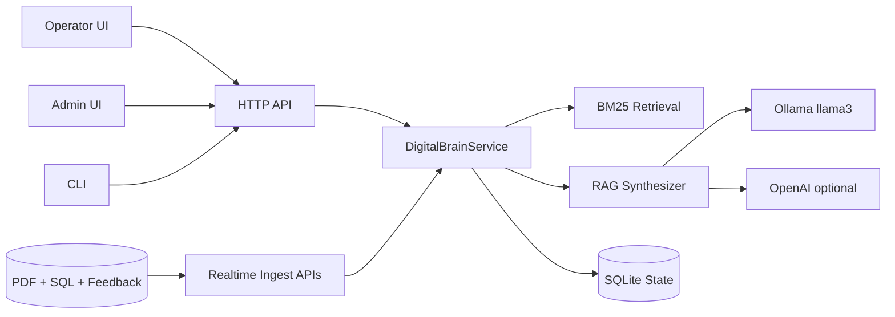

# Digital Brain Executive Brief

## 1. What This System Is
Digital Brain is an operator-first industrial troubleshooting platform that combines:

- Manual/SOP/Policy/Recipe retrieval
- Historical maintenance intelligence
- Interactive troubleshooting workflows
- Human-in-the-loop feedback learning

It is built to answer real factory-floor issues with grounded evidence and improve over time from actual repair outcomes.

---

## 2. Current Delivery Status
Overall: **MVP end-to-end delivered** with realtime updates and optional local LLM.

### Completed
- Seed ingestion from PDFs + SQL dumps
- Retrieval with citations and machine-aware context
- Operator diagnosis flow with yes/no branching
- Session persistence for troubleshooting state
- Feedback capture (`thumbs up/down` + workaround)
- Realtime ingest APIs (docs, complaints, trouble events)
- Realtime ranking updates from fresh feedback/history
- Admin dashboard analytics (breakdowns, unresolved, trends, risk queue)
- Confidence guardrails + audit logging
- Optional local LLM synthesis via **Ollama llama3** (default)

### Partially Complete / Next Hardening
- Production-grade auth/roles
- Scalable DB/index infrastructure beyond local SQLite
- Advanced observability dashboards
- Deeper semantic retrieval + stricter citation span validation

---

## 3. Architecture (High-Level)

Core runtime principle:
1. Retrieve grounded evidence
2. Synthesize response (LLM if available)
3. Enforce confidence guardrails
4. Persist interactions and learn from outcomes

---

## 4. Key User Flows

### Operator Flow
1. Select machine + describe issue
2. Receive grounded answer with citations and confidence
3. Execute interactive yes/no troubleshooting steps
4. Submit outcome and workaround
5. Next similar issue benefits from this new feedback

### Admin Flow
1. Monitor top breakdown machines
2. Track unresolved and at-risk issues
3. Review category/month trends
4. Identify knowledge gaps from recurring unresolved themes

---

## 5. Realtime Learning Behavior
The system updates recommendations immediately from:

- New complaints
- New trouble events
- New operator feedback workarounds
- Newly ingested manuals

This means the next query can use fresh field knowledge without waiting for batch retraining.

---

## 6. RAG and LLM Strategy

### Current behavior
- Retrieval-first grounding is always used
- LLM synthesis is optional, not mandatory
- Default provider is local: **Ollama + llama3**
- Deterministic fallback is automatic if LLM unavailable

### Safety controls
- Confidence score + confidence label in responses
- Low-evidence guardrail answer when support is weak
- Audit logging of major events and transitions

---

## 7. APIs (Executive View)

- Query + diagnosis: `/api/query`, `/api/troubleshoot/start`, `/api/troubleshoot/next`
- Feedback: `/api/feedback`
- Realtime ingest: `/api/realtime/document`, `/api/realtime/complaint`, `/api/realtime/trouble-event`
- Admin analytics: `/api/admin/analytics`
- Recent machine activity: `/api/machines/recent`

---

## 8. KPI-Ready Outputs Available Now
You can already measure:

- Frequent breakdown assets
- Unresolved issue backlog
- Failed feedback (at-risk queue)
- Feedback helpfulness trends
- Knowledge-gap keyword clusters
- Session-level troubleshooting progress

---

## 9. Immediate Next Steps (Recommended)
1. Move from SQLite to production DB + vector/hybrid retrieval infra.
2. Add auth/role model for operator/admin/governance separation.
3. Add service-level telemetry (latency, fallback rate, confidence distribution).
4. Expand test suite for concurrency and larger realtime ingest volume.
5. Strengthen semantic clustering for knowledge-gap insights.

---

## 10. Bottom Line
The platform is already functioning as a practical, self-improving troubleshooting assistant with realtime update capability and local-LLM support. The next phase is production hardening and scale, not core feature invention.
